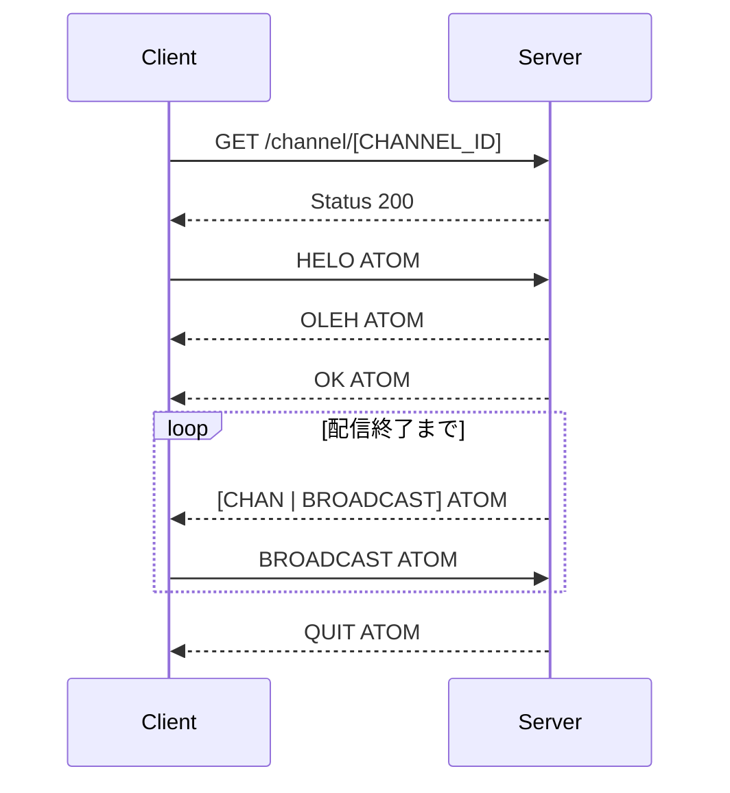
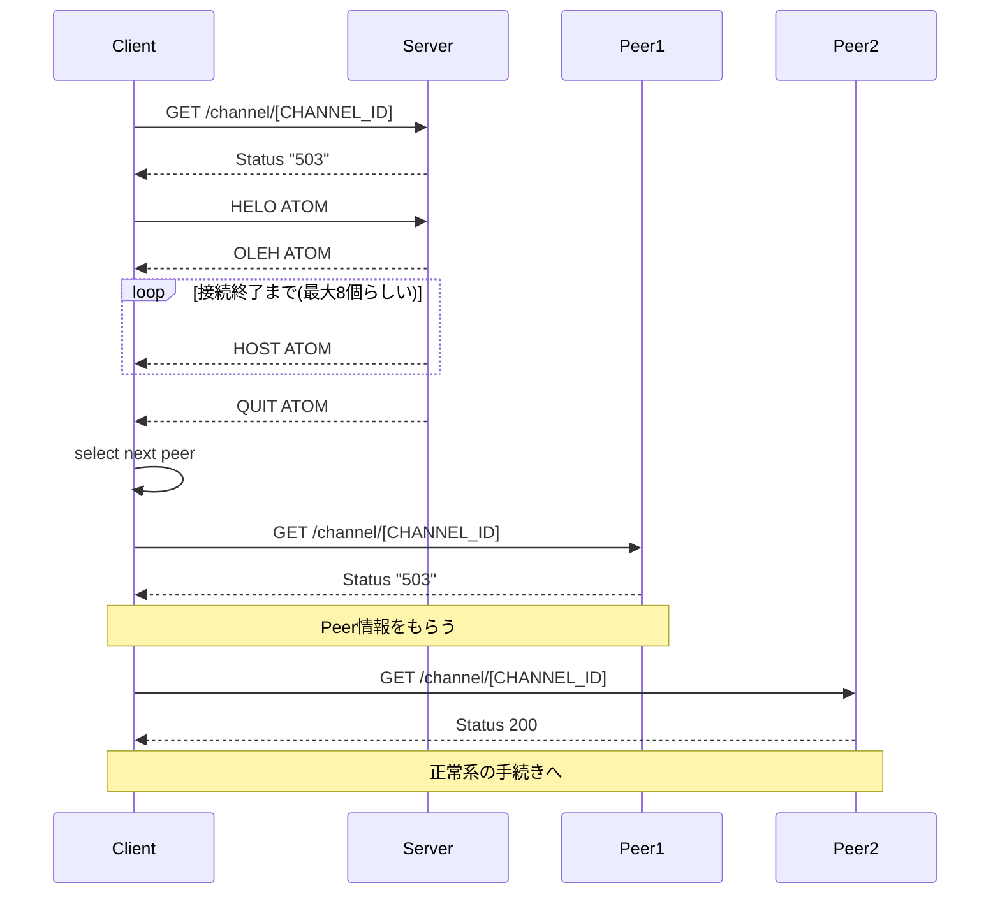

## 注意

- Local, Server, Peer は全て Peercast Application である。
- Server は配信者の Peercast
- Local は視聴者の Peercast
- Peer は視聴者の Peercast である。ただし既に Relay している状態の者
  - Relay とは Server が配信している Channel データを中継している状態を指す

## 正常系

## 異常系

Caster ->> OutConnection: spawn new task
Local ->> Channel: connect with ChannelID
Channel ->> EntryPoint: true
OutConnection ->> Remote: http request to Peercast remote
OutConnection ->> Remote: handshake PCP to Peercast remote
Remote -->> OutConnection: OLEH and OK atom packet
loop Receiving Task
Remote -->> OutConnection: OLEAH and OK atom packet

end
