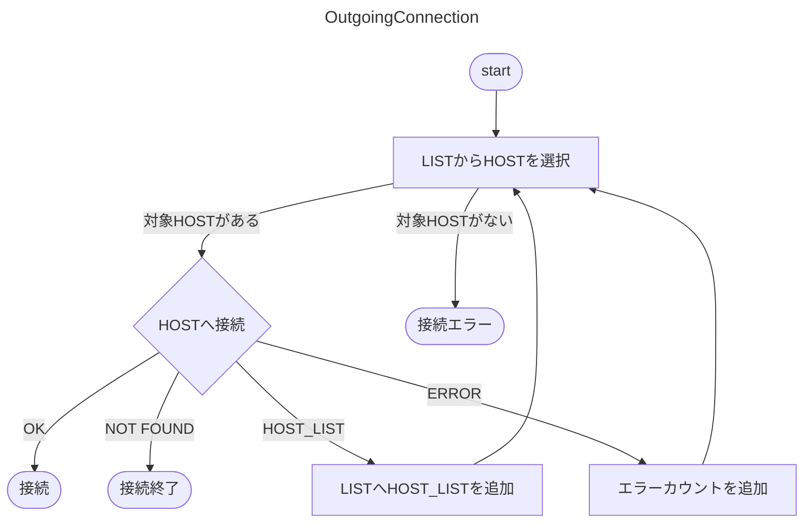

```mermaid
---
title: OutgoingConnection
---
flowchart TD
start([start])
start --> select_host[LISTからHOSTを選択]
select_host --> |対象HOSTがある| connect_host{HOSTへ接続}
select_host --> |対象HOSTがない| connect_fin([接続エラー])
connect_host --> |OK| connect_Server([接続])
connect_host --> |NOT FOUND| not_found([接続終了])
connect_host --> |HOST_LIST| add_host[LISTへHOST_LISTを追加]
connect_host --> |ERROR| connect_error[エラーカウントを追加]
connect_error --> select_host
add_host --> select_host
```
