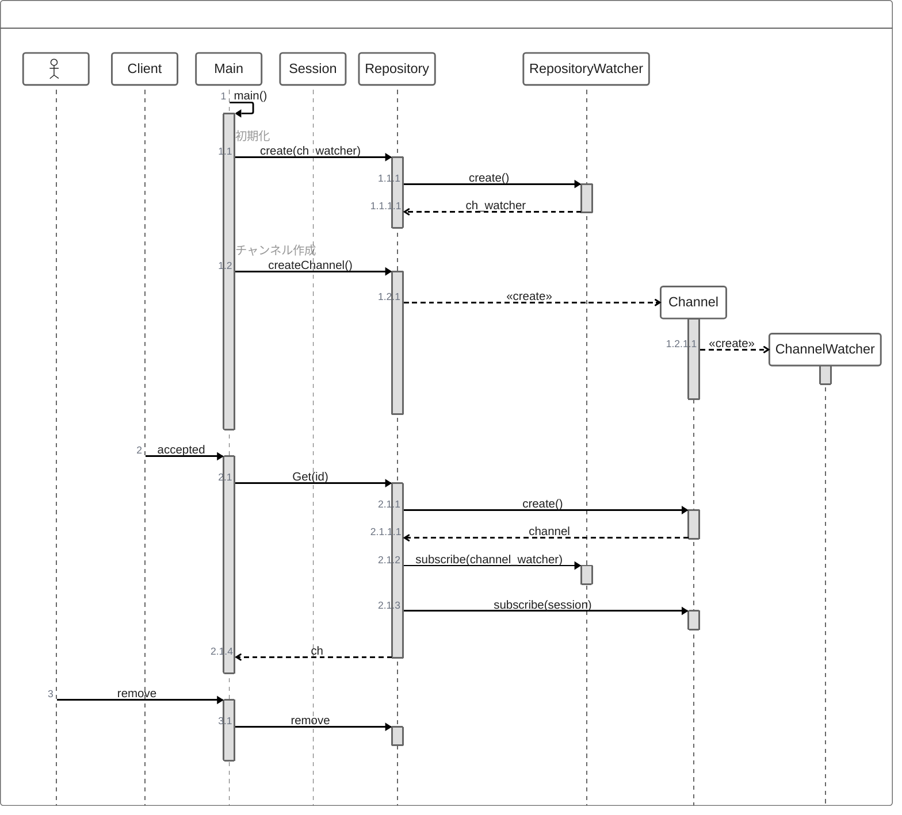
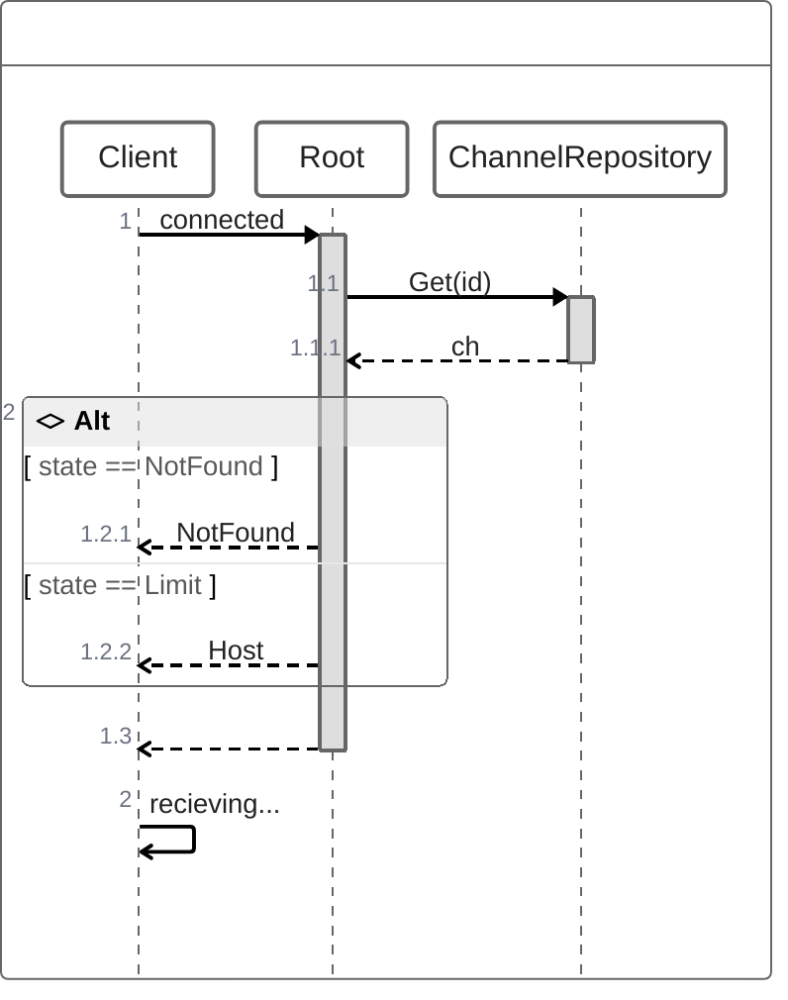
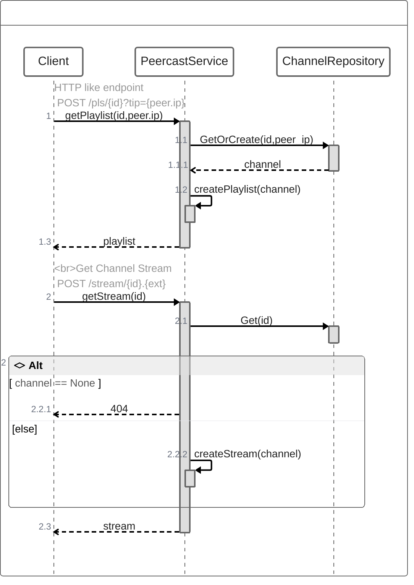

- RepositoryはすべてのChannelを保存しておりAPIとして機能する
- RepositoryWatcherは最終的にRepositoryを破棄するために機能する

```mermaid
zenuml
Client
Main
Session
Repository
RepositoryWatcher
Channel
ChannelWatcher

Main -> Main.main () {
    // 初期化
    Repository.create(ch_watcher) {
        ch_watcher = RepositoryWatcher.create()
    }
    
    // チャンネル作成
    Repository.createChannel() {
        new Channel() {
            new ChannelWatcher()
        }
    }
}

Client -> Main.accepted {
  ch = Repository.Get(id) {
    channel = Channel.create()
    RepositoryWatcher.subscribe(channel_watcher)
    Channel.subscribe(session)
  }
  // Session
}


Main.remove {
    Repository.remove
}

```

```mermaid
zenuml

Client -> Root.connected {
    ch = ChannelRepository.Get(id)

    if (state == NotFound){
        return NotFound
    }
    else if (state == Limit){
        return Host
    }
    return
}

Client -> Client : recieving...


```

B = Channel.get(id)  {

}
if (B == Connected) {

}else if (A == Connected){

}

B -> C

```mermaid
zenuml

// HTTP like endpoint
// `POST /pls/{id}?tip={peer.ip}`
Client -> PeercastService.getPlaylist(id, peer.ip) {
  channel = ChannelRepository.GetOrCreate(id, peer_ip)
  playlist = createPlaylist(channel)
  return playlist
}


// <br>Get Channel Stream
// `POST /stream/{id}.{ext}`
Client -> PeercastService.getStream(id) {
  ChannelRepository.Get(id)
  if(channel == None){
   @return
   PeercastService -> Client:404
  }else{
    stream = createStream(channel)
  }
  return stream
}
```
