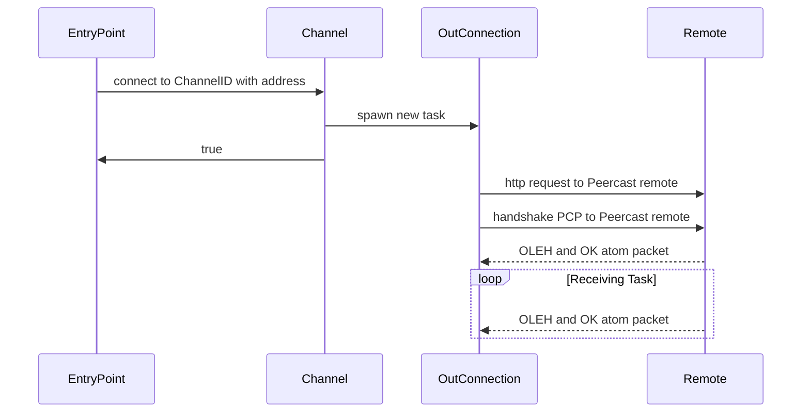
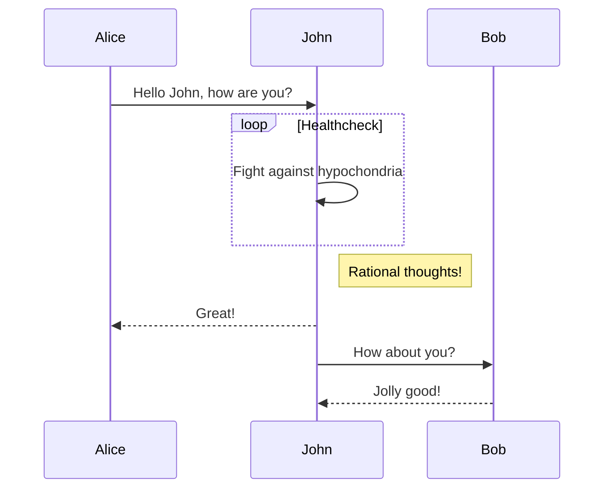

```mermaid
sequenceDiagram
EntryPoint ->> Channel: connect to ChannelID with address
Channel ->> OutConnection: spawn new task
Channel ->> EntryPoint: true
  OutConnection ->> Remote: http request to Peercast remote
  OutConnection ->> Remote: handshake PCP to Peercast remote
  Remote -->> OutConnection: OLEH and OK atom packet
loop Receiving Task
  Remote -->> OutConnection: OLEH and OK atom packet
end
```

- Channel ->> EntryPoint: ok

```mermaid
sequenceDiagram
Alice->>John: Hello John, how are you?
loop Healthcheck
    John->>John: Fight against hypochondria
end
Note right of John: Rational thoughts!
John-->>Alice: Great!
John->>Bob: How about you?
Bob-->>John: Jolly good!
```
