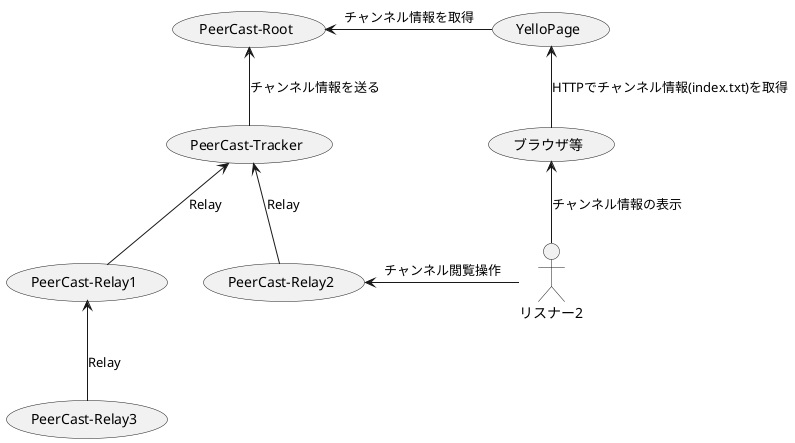
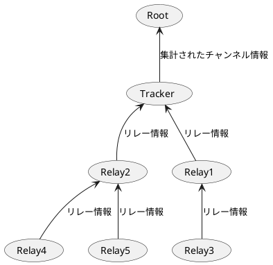

// cSpell:ignore SESSIONID, OLEH, REMOTEIP
// cSpell:disable
# 1.PeerCastによるチャンネル中継例

## 1.1想定されるシナリオ
1. PeerCast-Trackerが配信を始める
1. PeerCast-Rootにチャンネル情報を送る
1. YelloPageがチャンネル情報をブラウザで表示できるようにする
1. ユーザーがブラウザ等を使ってチャンネル情報一覧をHTTPで取得する
1. ユーザーがPeerCast-Relay2を操作してTrackerに中継を依頼する
1. TrackerがPeerCast-Relay2中継を開始して中継が始まる

### 注意
- この図では配信者, リスナー1, リスナー3を省略しています
- PCPで配信情報を取得する手段も昔あったような気がします


# 2. リレー開始の手続き


# 3. チャンネル情報の伝搬

登場人物
- Root: (PeerCast RootMode)
- Tracker: (PeerCast 配信者)
- Relay***N***: (PeerCast リスナー***N***)



// cSpell:enable

## 3.1 Trackerにリレー情報が伝わるシナリオ

## 3.2 集計されたチャンネル情報

# 4. Atom
PeerCastで行われる通信で用いられるデータフレームの単位をAtom(パケット)と言う。

```
(1)
+--------+-------------+---------+
| 4-byte |   4-byte    | N byte  |
+--------+-------------+---------+
| ID     | Type+Length | Payload |
+--------+-------------+---------+
Atomの構造(1)はID＋ATOMタイプ＋長さ＋ペイロードである。
IDはBigEndianで格納されており、先頭から4バイトの文字列とみなせる。

(2)
+-----------+-----------+-----------+----------------+
|   8bit    |   8bit    |   8bit    |      8bit      |
+-----------+-----------+-----------+----------------+
| Length[4] | Length[3] | Length[2] | TYPE|Length[0] |
+-----------+-----------+-----------+----------------+
Type+LengthはLittleEndianで格納されており、Most Significant Bit(MSB)がAtomの種類を示す。MSB=0の時、Child。MSB=1の時、Parentである。
```

Atomは```Parent```と```Child```の二種類に分けられその種類によって長さの意味とペイロードが変わる
- Parentの場合、ペイロードにはAtomが入り、その数がLengthに入る
- Childの場合、ペイロードにはバイナリが入り、そのバイト数が Lengthに入る
  - バイナリの詳細(char, short, intやエンディアン)はAtomが送られる文脈やIDに依存する。


## 4.1 データ構造


## 4.1 エンコーディング
- unsigned int (32bit) LittleEndian
- GnuID u8[16] Byte列
- IP
  - 192.168.10.1 -> payload : 0x01_0A_A8_C0 / 01=1, 0A=10, A8=168, C0=192  IPはLEで格納されている
  - オリジナルPeerCastがIP構造体をUInt32としてLEで書き込んでいるため逆順になっている

# 5. PeerCastProtocol
PeerCastで扱われる通信は3種類に分けられる。ここではその内の2種類、PCP通信とHTTP＋Upgrade通信について扱う
1. PCP通信
   1. ```pcp\n```で始まる通信 
1. HTTP+Upgrade通信
   1. ```GET /stream/[ChannelID]```で通信が始まり、HTTP BODYでPCP通信に切り替わる通信
1. その他
   1. HTTPを利用したストリーミング配信を再生するための通信
   1. RTMP/HTTP Push等ストリーミング配信をPeerCastへ送るための通信
   1. HTTPを利用したアプリケーションを操作する通信
   1. その他PeerCastのネットワークに関しない通信


## 5.1 用語
- Tracker: 配信者（のPeercast）
- Root: YP（々）
- Relay: リスナー（々）
- GnuID: 128bitの数値、IDとして利用される
- SessionID : 個々のPeerCastを認識するGnuID
- BroadcastID : TrackerがRootに送信するGnuID

## 5.2 PCP通信
この通信は次の二種類の目的で開始される（4.3の通信に続いて行われることもある）
1. PingPongによるポート開放チェック
ポート開放チェックは、ハンドシェイク中に接続先が接続元のポートが解放されているかチェックする文脈で行われる
   1. 通信方向：TrackerからRelayへ
   1. 通信方向：RelayからRelayへ
   1. 通信方向：RootからTrackerへ
2. Broadcastによる配信情報の通知
   1. 通信方向：TrackerからRootへ

### 4.2.1 PingPongによるポート開放チェック
ポート開放チェックではポートが解放されていることだけを目的としているためシンプルである
```
// 送信側
-> ChildAtom(PCP_CONNECT len:4 payload:1_u32)
-> ParentAtom(PCP_HELO len:1 child:[
        Atom(PCP_HELO_SESSIONID len:16 payload: bytes[16]) //
   ])
// 受信側
<- ParentAtom(PCP_OLEH len:5 child: [

   ])
// 送信側
-> ChildAtom(PCP_QUIT len:4 payload:PCP_ERROR_QUIT_u32)
通信終了
```
SessionIDのチェックを行い、申請してきたIDと同じであることが必要となる


### 4.2.2 BroadCastによる配信情報の通知
Broadcast

## 4.3 HTTP+Upgrade通信
この通信が開始される時はPeerCastでRelayを行うための通信である。


# 6.具体的なRootとの通信例

## 6.1 PCPによるポート開放チェック
PCP通信は相手のポートが開いているか確認するときに使う

### 想定されるシナリオ
- AからBへPcpHTTPによる通信を開始
- CHECK: Bにリレーして良いか確認するため、BはAのポート開放チェックを行う。
- BからAへPCP通信を開始。Bのポートが空いていることを確認する。

※ 不要に重い通信を行わないようにPcpHttp通信でないとポートチェックを行うことはない
   ≒ B側がChannelIdをリレーしていない時に

1. BがAにPCP接続
```
atom.writeInt(PCP_CONNECT, 1);
atom.writeParent(PCP_HELO, 1);
    atom.writeBytes(PCP_HELO_SESSIONID, servMgr->sessionID.id, 16);
```
2. AがBにOLEH返信
```
atom.writeParent(PCP_OLEH, 5);
    atom.writeString(PCP_HELO_AGENT, PCX_AGENT);
    atom.writeBytes(PCP_HELO_SESSIONID, servMgr->sessionID.id, 16);
    atom.writeInt(PCP_HELO_VERSION, PCP_CLIENT_VERSION);
    atom.writeAddress(PCP_HELO_REMOTEIP, rhost.ip);
    atom.writeShort(PCP_HELO_PORT, rhost.port);
```
3. BがOLEHを受信、QUITする
        atom.writeInt(PCP_QUIT, PCP_ERROR_QUIT);
4. BがOLEHからSESSION_IDを拾って照合できたらAからBへの通信をポート開放済みのホストとして継続

## 5.2 TrackerからRootへの接続とチャンネル情報の通知
1. TrackerからRootへPCP通信handshake開始
```
atom.writeInt(PCP_CONNECT, 1);
atom.writeParent(PCP_HELO, 1);
    atom.writeBytes(PCP_HELO_SESSIONID, servMgr->sessionID.id, 16);
    atom.writeInt(PCP_HELO_VERSION, PCP_CLIENT_VERSION);
    atom.writeBytes(PCP_HELO_SESSIONID, sessionID.id, 16);
    atom.writeBytes(PCP_HELO_BCID, broadcastID.id, 16); // 認証に用いる

```

1. RootがPCP_CONNECT, PCP_HELOを受信
- REMOTEのSESSION_ID が最低限必要
```
PCPStream::readVersion(*sock);
// ID == PCP_HELO 
for (int i=0; i<numc; i++)
```
1. RootがOLEHを返信(ポート開放チェックを行うこと)
```
atom.writeParent(PCP_OLEH, 5);
    atom.writeString(PCP_HELO_AGENT, PCX_AGENT);
    atom.writeBytes(PCP_HELO_SESSIONID, self_session_id, 16);
    atom.writeInt(PCP_HELO_VERSION, PCP_CLIENT_VERSION);
    atom.writeAddress(PCP_HELO_REMOTEIP, remote_host.ip);
    atom.writeShort(PCP_HELO_PORT, remote_host.port); // 0はポート開放チェックが失敗
```

1. RootがRootAtomを書き込みG
```
atom.writeParent(PCP_ROOT, 5);
    atom.writeInt(PCP_ROOT_UPDINT, chanMgr->hostUpdateInterval); //120 sec
    atom.writeString(PCP_ROOT_URL, "download.php"); // http://www.peercast.org/"に結合されるようになってる -> 使われていない
    atom.writeInt(PCP_ROOT_CHECKVER, PCP_ROOT_VERSION); // 1218
    atom.writeInt(PCP_ROOT_NEXT, chanMgr->hostUpdateInterval); // 120 sec
    atom.writeString(PCP_MESG_ASCII, rootMsg.cstr()); // ASCIIで何かしら文字を入れられる
    if (getUpdate)
       atom.writeParent(PCP_ROOT_UPDATE, 0);

```

1. RootがPCP_OKを書き込み handshake完了
```
atom.writeInt(PCP_OK, 0); 
```

1. Rootが次のAtomを送信
```
atom.writeParent(PCP_ROOT, 1);
    atom.writeParent(PCP_ROOT_UPDATE, 0);  // これがあるとTrackerがBroadcastで送ってくる
```

1. TrackerがこのPCP_ROOT_UPDATEを受信するとPCP_BCSTを返す
```
    atom.writeParent(PCP_BCST, 10);
        atom.writeChar(PCP_BCST_GROUP, PCP_BCST_GROUP_ROOT);
        atom.writeChar(PCP_BCST_HOPS, 0);
        atom.writeChar(PCP_BCST_TTL, 7);
        atom.writeBytes(PCP_BCST_FROM, servMgr->sessionID.id, 16);
        atom.writeInt(PCP_BCST_VERSION, PCP_CLIENT_VERSION);
        atom.writeInt(PCP_BCST_VERSION_VP, PCP_CLIENT_VERSION_VP);
        atom.writeBytes(PCP_BCST_VERSION_EX_PREFIX, PCP_CLIENT_VERSION_EX_PREFIX, 2);
        atom.writeShort(PCP_BCST_VERSION_EX_NUMBER, PCP_CLIENT_VERSION_EX_NUMBER);
        atom.writeParent(PCP_CHAN, 4);                                                              // <-- 少しややこしいが再帰呼び出しの結果このAtomをProcAtomで処理される
            atom.writeBytes(PCP_CHAN_ID, info.id.id, 16);
            atom.writeBytes(PCP_CHAN_BCID, chanMgr->broadcastID.id, 16); // BCIDをここでも含めるこれはHELOに含めるBCIDと同じである
            info.writeInfoAtoms(atom);
            info.writeTrackAtoms(atom);
        hit.writeAtoms(atom, info.id);
```

1. Rootは 一定時間毎にPCP_BCSTを送って Trackerに更新を促す
```

if (servMgr->isRoot)
{
    if ((ctime - lastRootBroadcast) > chanMgr->hostUpdateInterval)
    {
        servMgr->broadcastRootSettings(true);
        lastRootBroadcast = ctime;
    }
}

// --------------------------------------------------
void ServMgr::broadcastRootSettings(bool getUpdate)
{
    if (isRoot)
        atom.writeParent(PCP_BCST, 9);
            atom.writeChar(PCP_BCST_GROUP, PCP_BCST_GROUP_TRACKERS);
            atom.writeChar(PCP_BCST_HOPS, 0);
            atom.writeChar(PCP_BCST_TTL, 7);
            atom.writeBytes(PCP_BCST_FROM, sessionID.id, 16);
            atom.writeInt(PCP_BCST_VERSION, PCP_CLIENT_VERSION);
            atom.writeInt(PCP_BCST_VERSION_VP, PCP_CLIENT_VERSION_VP);
            atom.writeBytes(PCP_BCST_VERSION_EX_PREFIX, PCP_CLIENT_VERSION_EX_PREFIX, 2);
            atom.writeShort(PCP_BCST_VERSION_EX_NUMBER, PCP_CLIENT_VERSION_EX_NUMBER);
            writeRootAtoms(atom, getUpdate);
```

```cpp
// --------------------------------------------------
void ServMgr::writeRootAtoms(AtomStream &atom, bool getUpdate)
{
    atom.writeParent(PCP_ROOT, 5 + (getUpdate?1:0));
        atom.writeInt(PCP_ROOT_UPDINT, chanMgr->hostUpdateInterval);
        atom.writeString(PCP_ROOT_URL, "download.php");
        atom.writeInt(PCP_ROOT_CHECKVER, PCP_ROOT_VERSION);
        atom.writeInt(PCP_ROOT_NEXT, chanMgr->hostUpdateInterval);
        atom.writeString(PCP_MESG_ASCII, rootMsg.cstr());
        if (getUpdate)
            atom.writeParent(PCP_ROOT_UPDATE, 0);  // <-- これをTrackerが受信したら送る
}
```


3. Trackerは前回送信から30秒たっていたらYPにPCP_BCST_ATOMを通知する
   ※PCP_ROOT_UPDATEに対して返信した場合、その時点でタイマーはリセットされる
